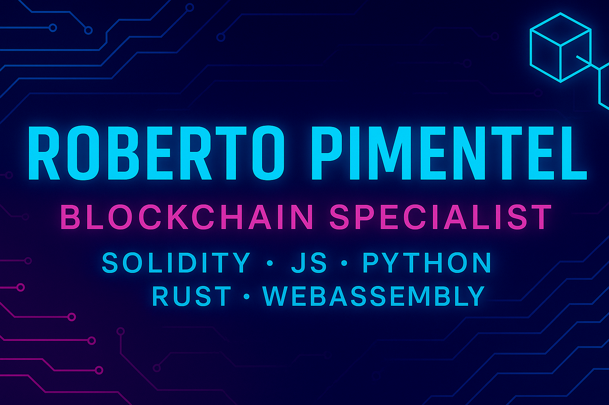

  

  <svg width="450" height="60">
    <text x="50%" y="50%" dominant-baseline="middle" text-anchor="middle" font-size="22" fill="#0984e3">
      Blockchain Specialist | Solidity • JS • Python
    </text>
  </svg>

## 🐍 Contribution Snake

---

---

---

## 🇺🇸 About me

I’m **Roberto Pimentel**, a **fullstack developer specialized in Blockchain**, focusing on **smart contracts**, **Web3 interfaces**, **dApps (decentralized applications)** and **ZkVerify**. I’m proficient in **Solidity**, **Python**, **JavaScript**, **React**, **Hardhat**, **Web3.js**, **Foundry** and **Rust**, building secure and scalable blockchain solutions from the backend to the frontend.

---

## 🚀🥋 Technologies and proficiency levels

  
  
  
  
  
  
  
  
  
  
  
  
  
  

---

### 💼 My skillset includes:

- Development of secure and scalable **dApps**
- Writing and testing **smart contracts** using Solidity, Cairo and Rust.
- Connecting wallets using **Web3.js** and **Ethers.js**
- Building APIs with Flask and FastAPI in Python
- Crafting Web3 interfaces with React and modern frameworks
- Hardhat and Foundry Mastery
- Implementation of **Zero-Knowledge Proofs (ZKPs)** for enhanced privacy and scalability in blockchain applications

---

## 🌐 Let's connect

- 💼 [LinkedIn](https://www.linkedin.com/in/robertoblockchainresources)
- 📧 Email: roberto.blockchainresources@gmail.com
- 🌐 [Access my portfolio here!](https://beto-rocha-blockchain.github.io/beto-rocha-blockchain/)

  <svg width="300" height="30">
    <text x="50%" y="50%" dominant-baseline="middle" text-anchor="middle" font-size="18" fill="#00cec9">
      Let's build the decentralized future together!
    </text>
  </svg>

---

## 🇧🇷 Sobre mim

Sou **Roberto Pimentel**, um **desenvolvedor fullstack especializado em Blockchain**, com foco em **contratos inteligentes**, **interfaces Web3** e aplicações descentralizadas. Sou proficiente em **Solidity**, **Python**, **JavaScript**, **React**, **Hardhat**, **Web3.js**, **Foundry** e **Rust**, construindo soluções de blockchain seguras e escaláveis ​​do backend ao frontend.

---

## 🚀🥋 Tecnologias e níveis de proficiência

  
  
  
  
  
  
  
  
  
  
  
  
  
  

---

### 💼 Minhas habilidades incluem:

- Desenvolvimento de **dApps** seguros e escaláveis
- Criação e testes de **smart contracts** em Solidity, Cairo e Rust.
- Conexão de carteiras com **Web3.js** e **Ethers.js**
- Construção de APIs em Python com Flask e FastAPI
- Interfaces Web3 com React.js e frameworks modernos
- Domínio de Hardhat e Foundry
- Implementação de **Provas de Conhecimento Zero (ZKPs)** para maior privacidade e escalabilidade em aplicações blockchain

---

## 🌐 Onde me encontrar

- 💼 [LinkedIn](https://www.linkedin.com/in/robertoblockchainresources)
- 📧 Email: roberto.blockchainresources@gmail.com
- 🌐 [Acesse meu portfólio aqui!](https://beto-rocha-blockchain.github.io/beto-rocha-blockchain/)

  <svg width="300" height="30">
    <text x="50%" y="50%" dominant-baseline="middle" text-anchor="middle" font-size="18" fill="#6c5ce7">
      Vamos construir o futuro descentralizado juntos!
    </text>
  </svg>

